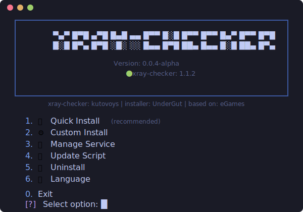
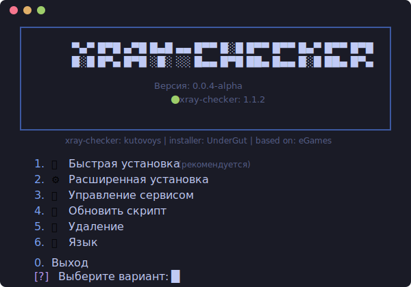

# xray-checker-installer

[](https://opensource.org/licenses/MIT)
[](https://github.com/UnderGut/xray-checker-installer)

Auto-installer for [xray-checker](https://github.com/kutovoys/xray-checker) — a monitoring tool for proxy servers (VLESS, VMess, Trojan, Shadowsocks).

<p align="center">
  
</p>

[🇷🇺 Русская версия](#русская-версия)

## ⚡ Quick Install

```bash
bash <(curl -Ls https://raw.githubusercontent.com/UnderGut/xray-checker-installer/main/install_xray_checker.sh)
```

After installation, use `xchecker` command to open the management menu.

## ✨ Features

### Installation
- **🚀 Quick Install** — one command, minimal questions (just subscription URL)
- **⚙️ Custom Install** — full control over all settings
- **🐳 Docker** — recommended, with auto-update support
- **📦 Binary** — systemd service for systems without Docker

### Reverse Proxy & SSL
- **🔍 Auto-detection** — finds existing Nginx/Caddy installations
- **🌐 Nginx in Docker** — automatic setup with SSL
- **🔒 SSL Certificates**:
  - Cloudflare DNS-01 (supports wildcard)
  - ACME HTTP-01 (Let's Encrypt)
  - Gcore DNS-01
  - Use existing certificates

### Integration
- **🔗 Remnawave API** — auto-create `XrayChecker` user with squads
- **🔐 Basic Auth** — auto-generated secure credentials
- **📊 Prometheus ready** — metrics endpoint `/metrics`

### Multi-language
- 🇬🇧 English
- 🇷🇺 Russian

## 📋 Requirements

| Requirement | Details |
|-------------|---------|
| **OS** | Debian 11/12, Ubuntu 22.04/24.04 |
| **Access** | Root privileges |
| **Docker** | Auto-installed if not present |

## 🎯 Usage

### Management Menu

```bash
xchecker
# or
xray_checker_install
```

### Menu Options

See the screenshot above for the menu interface.

## 📁 Installation Structure

```
/opt/xray-checker/
├── docker-compose.yml    # Docker services configuration
├── .env                  # All environment variables
├── nginx.conf            # Nginx config (if using nginx)
├── installer.conf        # Installer settings
├── install_method        # "docker" or "binary"
└── selected_language     # "en" or "ru"
```

## 🔧 Service Management

The **Manage Service** menu provides:

- **Start/Stop/Restart** — control xray-checker service
- **View Logs** — see real-time container logs
- **Update** — pull latest Docker image
- **Edit Config** — modify `.env` file
- **View Status** — check service health

## 🔐 API Endpoints

| Endpoint | Auth | Description |
|----------|------|-------------|
| `GET /` | Optional | Web UI dashboard |
| `GET /health` | No | Health check (returns `OK`) |
| `GET /metrics` | Basic Auth | Prometheus metrics |
| `GET /config/{id}` | Optional | Proxy status (200=OK, 503=Failed) |
| `GET /api/v1/proxies` | Basic Auth | Proxy list with details |
| `GET /api/v1/status` | Basic Auth | Statistics summary |
| `GET /api/v1/public/proxies` | No | Public proxy list (no sensitive data) |

> **Note:** "Optional" means protected when `WEB_PUBLIC=false` (default)

## 🔗 Remnawave Integration

The installer can automatically create a monitoring user in Remnawave Panel:

1. Select **"Remnawave API"** during subscription setup
2. Enter Panel URL and API token
3. Choose squads for the `XrayChecker` user
4. Subscription URL is fetched automatically

Supports both official Remnawave installation and [eGames script](https://github.com/eGamesAPI/remnawave-reverse-proxy) (with cookie authentication).

## 🌐 Reverse Proxy Scenarios

| Scenario | Action |
|----------|--------|
| Fresh server | Install Nginx/Caddy in Docker |
| Existing Remnawave | Add to existing nginx/caddy config |
| eGames installation | Use existing certificates and nginx |
| Own nginx/caddy | Show config block to copy |
| No proxy needed | Direct access via `http://IP:2112` |

## 📊 Monitoring Integration

### Prometheus

Add to `prometheus.yml`:

```yaml
scrape_configs:
  - job_name: 'xray-checker'
    static_configs:
      - targets: ['your-server:2112']
    basic_auth:
      username: 'your-username'
      password: 'your-password'
```

### Uptime Kuma

- **Health check**: `http://your-server:2112/health`
- **Specific proxy**: `http://your-server:2112/config/{stableId}`

## 🙏 Credits

This project would not be possible without:

| Project | Author | Description |
|---------|--------|-------------|
| [xray-checker](https://github.com/kutovoys/xray-checker) | **kutovoys** | The main monitoring tool this installer deploys |
| [remnawave-reverse-proxy](https://github.com/eGamesAPI/remnawave-reverse-proxy) | **eGames** | The installation script structure and patterns used as a foundation |
| [Remnawave Panel](https://github.com/remnawave/panel) | Remnawave Team | VPN panel with subscription support |

Special thanks to **eGames** — the `install_remnawave.sh` script served as the foundation for this installer's architecture, menu system, and multi-language support.

## 📄 License

This project is licensed under the [MIT License](LICENSE).

## 🤝 Contributing

Contributions are welcome! Please feel free to submit a Pull Request.

---

# Русская версия

Автоустановщик для [xray-checker](https://github.com/kutovoys/xray-checker) — инструмента мониторинга прокси-серверов (VLESS, VMess, Trojan, Shadowsocks).

<p align="center">
  
</p>

## ⚡ Быстрая установка

```bash
bash <(curl -Ls https://raw.githubusercontent.com/UnderGut/xray-checker-installer/main/install_xray_checker.sh)
```

После установки используйте команду `xchecker` для открытия меню управления.

## ✨ Возможности

### Установка
- **🚀 Быстрая установка** — одна команда, минимум вопросов
- **⚙️ Расширенная установка** — полный контроль над настройками
- **🐳 Docker** — рекомендуется, с поддержкой авто-обновления
- **📦 Binary** — systemd сервис для систем без Docker

### Reverse Proxy и SSL
- **🔍 Автодетект** — находит существующие Nginx/Caddy
- **🌐 Nginx в Docker** — автоматическая настройка с SSL
- **🔒 SSL сертификаты**: Cloudflare, ACME, Gcore, существующие

### Интеграции
- **🔗 Remnawave API** — авто-создание пользователя `XrayChecker` со сквадами
- **🔐 Basic Auth** — авто-генерация учётных данных
- **📊 Prometheus** — эндпоинт метрик `/metrics`

### Мультиязычность
- 🇬🇧 Английский
- 🇷🇺 Русский

## 📋 Требования

| Требование | Описание |
|------------|----------|
| **ОС** | Debian 11/12, Ubuntu 22.04/24.04 |
| **Доступ** | Root права |
| **Docker** | Устанавливается автоматически |

## 🎯 Использование

### Меню управления

```bash
xchecker
# или
xray_checker_install
```

Скриншот меню показан выше.

## 🔗 Интеграция с Remnawave

Установщик может автоматически создать пользователя для мониторинга в панели Remnawave:

1. Выберите **"Remnawave API"** при настройке подписки
2. Введите URL панели и API токен
3. Выберите сквады для пользователя `XrayChecker`
4. URL подписки получается автоматически

Поддерживается как официальная установка Remnawave, так и [скрипт eGames](https://github.com/eGamesAPI/remnawave-reverse-proxy) (с cookie-авторизацией).

## 🌐 Сценарии Reverse Proxy

| Сценарий | Действие |
|----------|----------|
| Чистый сервер | Установка Nginx/Caddy в Docker |
| Есть Remnawave | Добавление в существующий конфиг |
| Установка eGames | Использование существующих сертификатов |
| Свой nginx/caddy | Показ конфига для копирования |
| Без proxy | Прямой доступ через `http://IP:2112` |

## 🙏 Благодарности

| Проект | Автор | Описание |
|--------|-------|----------|
| [xray-checker](https://github.com/kutovoys/xray-checker) | **kutovoys** | Основной инструмент мониторинга |
| [remnawave-reverse-proxy](https://github.com/eGamesAPI/remnawave-reverse-proxy) | **eGames** | Основа для структуры установщика |
| [Remnawave Panel](https://github.com/remnawave/panel) | Remnawave Team | VPN панель с поддержкой подписок |

Особая благодарность **eGames** — скрипт `install_remnawave.sh` послужил основой для архитектуры, системы меню и мультиязычности этого установщика.

## 📄 Лицензия

Проект лицензирован под [MIT License](LICENSE).
